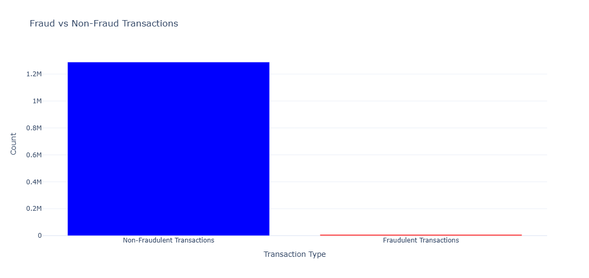
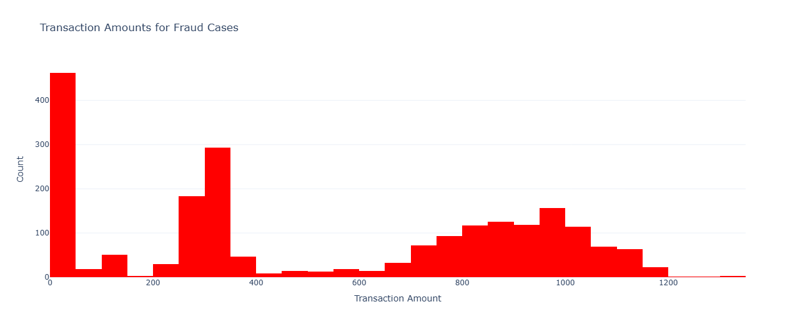
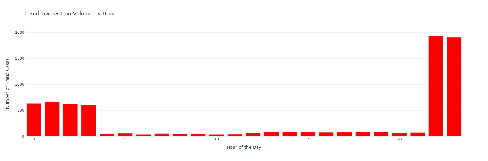
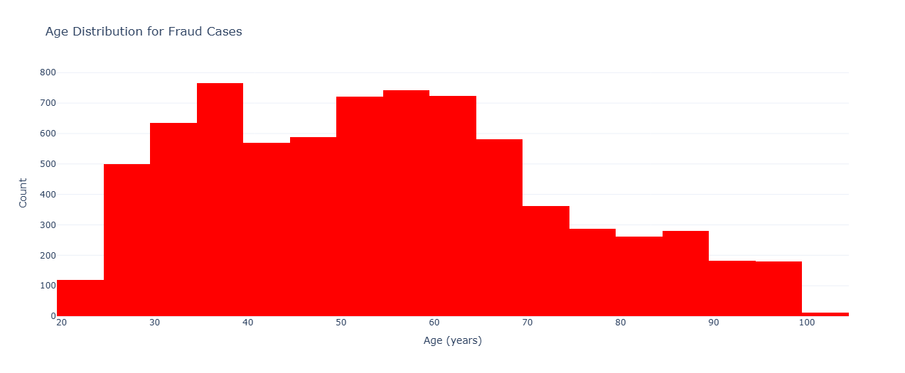
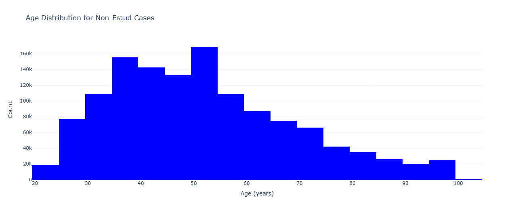

# Bank Fraud Detection Using PySpark  

## Project Overview  
This project focuses on detecting fraudulent bank transactions using PySpark. Given the large and imbalanced dataset, distributed data processing is leveraged to efficiently identify potentially fraudulent transactions.  

---

## Data Understanding  
 
This dataset is split into two parts: a training set **fraud_train** and a testing set **fraud_test**. The training set contains 1,296,675 rows of transaction data, while the testing set contains 555,719 rows. Both datasets share the same schema as shown below.

| Column Name              | Data Type  | Description               |
|--------------------------|------------|---------------------------|
| `_c0`                    | Integer    | Index column              |
| `trans_date_trans_time`  | Timestamp  | Transaction date and time |
| `cc_num`                 | Long       | Credit card number        |
| `merchant`               | String     | Merchant name             |
| `category`               | String     | Transaction category      |
| `amt`                    | Double     | Transaction amount        |
| `first`                  | String     | First name                |
| `last`                   | String     | Last name                 |
| `gender`                 | String     | Gender                    |
| `street`                 | String     | Street address            |
| `city`                   | String     | City                      |
| `state`                  | String     | State                     |
| `zip`                    | Integer    | ZIP code                  |
| `lat`                    | Double     | Latitude                  |
| `long`                   | Double     | Longitude                 |
| `city_pop`               | Integer    | City population           |
| `job`                    | String     | Job title                 |
| `dob`                    | Date       | Date of birth             |
| `trans_num`              | String     | Transaction number        |
| `unix_time`              | Integer    | Unix timestamp            |
| `merch_lat`              | Double     | Merchant latitude         |
| `merch_long`             | Double     | Merchant longitude        |
| `is_fraud`               | Integer    | Fraud flag (1 = fraud)    |

 Below are some of the distribution information derived from the data

## Exploratory Data Analysis (EDA) 

 
- Fraud cases are 7506 in number, making that 0.5% iof the total transaction. The data is extremely imbalanced
 
 
- Alot of fraud cases are between 0-400. This could be to avoid detection making small purchases.
Less common cases are above 600.
 
 
- Fraud cases seem to happen throughout the day, but more in the evening to right after midnight
 
 
 
 
 
- Non-fraud cases
     - Most transactions are between 30 and 60 years throught to 80 years. Majority are working class and retirees
     - There are also transactions made by 90 and 100 year olds too.
- Fraud cases
     - Alot of these are between 30 and 60 to 90 year olds. These are of course the target victims.

---

## Data Preprocessing  
### 1. Data Cleaning  
- Rename the columns for better understanding
  - `first` to `first_name`
  - `last` to `last_name`
  - `city_pop` to `city_population`
  - `dob` to `date_of_birth` 

### 2. Feature Engineering  
- Add the `age` column derived from date_of_birth
- Create `transaction_hour` and `transaction_day`, `transaction_month`
- Add a distance in kilometres column `distance_cust_to_merch(km)`
- Drop columns that are not needed in the modelling.
  - `_c0`
  - `cc_num`
  - `trans_num`
  - `unix_time`
  - `first_name`
  - `last_name`
  - `street`
### 3. Data Encoding and Scaling
##### Correlation
- The data was encoded, and the correlation between each feature and the is_fraud column was calculated. The **VectorAssembler** was used to combine the features into a single vector column `new_features` before calculating the correlations using the **stat.corr** function, which handles cases where a features column might already exist.
    - Correlation between amt and is_fraud: 0.21940388895887128
    - Correlation between city_population and is_fraud: 0.0021359024181982463
    - Correlation between age and is_fraud: 0.012378101674716485
    - Correlation between transaction_month and is_fraud: -0.012409331585155019
    - Correlation between transaction_hour and is_fraud: 0.01379937052344759
    - Correlation between transaction_day and is_fraud: 0.009620213899482673
    - Correlation between distance_cust_to_merch(km) and is_fraud: 0.00043417047602957134
    
- The correlations between features and is_fraud are generally weak. The strongest correlation is with `amt`: (0.002), indicating a slight positive relationship. Other features, such as `city_population`, `age`, `transaction_month`, `transaction_hour`, `transaction_day`, and `distance_cust_to_merch`, show negligible all close to zero correlation.

##### Encoding
- Next was setting up a pipeline for feature engineering in Spark. Handle the categorical features by using *StringIndexer* and *OneHotEncoder* to convert them into numerical representations. Scaled the numerical features using **StandardScaler** after assembling them into a vector. Then combined the encoded categorical features with the scaled features into a final features vector using VectorAssembler. Numerical features were then scaled

##### Handling class imbalance
- Addressed class imbalance by applying dynamic class weights to each record in the training dataset. This involved computing the weights for both fraud and non-fraud classes based on their counts and adding a new `class_weight` column. These weights help the model treat both classes fairly during training, improving its ability to detect fraudulent transactions.
    - Fraud Weight: 86.37
    - Non-Fraud Weight: 0.50

---

## Modeling  
### Random Forest Classifier  
A Random Forest model was trained to classify fraudulent transactions using multiple features. Below are the results
    - **True Positives (TP):** 1,403 — Correct fraud predictions
    - **False Positives (FP):** 25,231 — Non-fraud cases incorrectly predicted as fraud
    - **True Negatives (TN):** 528,343 — Correct non-fraud predictions
    - **False Negatives (FN):** 618 — Fraud cases missed by the model
    - **Recall:** 68.8% -  The model detects fraud cases moderately.
    - **Precision:** 5.6% - This indicates that a significant number of non-fraud cases are falsely flagged as fraud.

---

## Conclusion
The Random Forest classifier demonstrated moderate recall (68.8%), successfully identifying most fraudulent transactions. However, precision was low (5.6%), indicating a significant number of false fraud flags. This trade-off suggests that while the model is good at catching fraudulent cases along with legitimate ones, it requires further tuning to minimize disruptions from false alerts.

---

## Recommendation
Given the high cost of false positives in financial operations, adjusting the decision threshold or implementing cost-sensitive evaluation strategies would be essential to balance the model's performance. For production-level deployment, closer collaboration with domain experts and further refinement of feature engineering techniques are recommended to improve precision.

